

# Lab06: Comunicación UART con PIC18F45K22

## Integrantes

* [Laura Alejandra Fuentes Ubaque](https://github.com/LauraAlejandraFuentes)
* [Juan Sebastian Guerrero Gualteros](https://github.com/juanseguerrerogu07)
* [Pedro Felipe Jimenez Celis](https://github.com/pedrofejimenezce-ship-it)
* [Samuel Corro Pedrozo](https://github.com/SamuelCorro)

## Documentación

**1. Objetivos de aprendizaje**

1.Configurar el módulo **UART** en un microcontrolador PIC para permitir la comunicación serial

2.Transmitir datos a través del UART desde el PIC hacia un terminal serial conectado a través de USB-UART

3.Implementar funciones de tranmisión y recepción de datos a través de **UART**

4.Visualizar los datos recibidos en el terminal y comprender el proceso de transmisión asíncrona

**2. Materiales**

1.PIC18F45K22 o cualquier PIC compatible

2.Programador/debugger PICkit 4

3.Fuente de alimentación (PICkit 4)

4.Conversor USB a seral UART

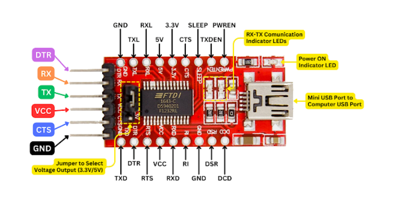

4.Cable de conexión entre el conversor y el PC

5.Software de terminal serial (puede usar PuTTY, Tera Term, o cualquier terminal de comunicación serial)

6.MPLAB + XC8

**3.Fundamento teórico**

El módulo **EUSART** (Enhanced Universal Synchronous Asynchronous Receiver Transmitter) del PIC18F45K22 permite la comunicación serail tanto síncrona como asíncrona. En este laboratorio se usará en modo asíncrono (UART), que no requiere señal de reloj adicional y es muy común para comunicación con PCs u otros dispositivos.

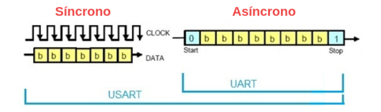

**- UART (Universal Asynchronous Receiver/Transmitter):** es un protocolo de comunicación serial utilizado para la transmisión de datos de forma asíncrona, es decir, sin necesidad de una señal de reloj externa. En un sistema UART, dos dispositivos se comunican a través de dos líneas: TX (transmisión) y RX (Recepción), como se muestra en el siguiente diagrama. El PIC18F45K22 tiene un modulo UART que se puede configurar para transmitir y recibir datos en serie.

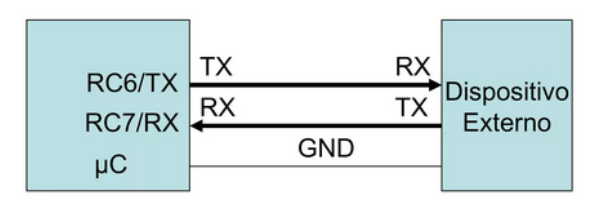

A continuación se enlistan algunos parámetros relveantes:

-Baud Rate: La tasa de transferencia de datos. El valor común para este ejemplo es 9600 bps

-Bits de datos: Generalmente se usan 8 bits de datos en la transmisión.

-Paridad: La paridad es un mecanismo de verificación que añade un bit extra a los datos transmitidos para detectar posibles errores en la comunicación serial. No se usa en este ejemplo

-Bits de parada: Un bit de parada indica el final de un byte transmitido

**4.Procedimiento**

🔹Archivo uart.c - Implementación de la comunicación UART

1.Función UART_Init(void):

-TRISC6 = 0 configura el pin RC6 como salida (TX).

-TRISC7 = 1 configura el pin RC7 como entrada (RX).

Estos pines están conectados internamente al módulo EUSART.

-SPBRG1 es el registro que determina el divisor del reloj para establecer la velocidad de baudios.

En este caso, el módulo USART en el PIC18F45K22 debe configurarse para transmitir y recibir datos a una velocidad de 
9600 bps. El valor de la constante de baudios (SPBRG) debe calcularse según la fórmula:

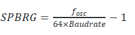

Para un oscilador de 16 MHz y un baudrate de 9600, el valor de SPBRG es 25.

-BRGH = 0: Baja velocidad (divisor de 64)

Este bit se encuentra en el registro TXSTA1 y controla la velocidad del generador de baud rate:

    -Generador de Baud Rate de 8 bits (BRG16 = 0):

    Cuando el bit BRG16  está configurado a 0, significa que el generador de baud rate utiliza un registro de 8 bits (SPBRG) para almacenar el valor calculado. Esto permite generar velocidades de transmisión, pero con una precisión limitada debido a la resolución del registro de 8 bits (pudiendo almacenar valores de 0 a 255).

    En este caso, el divisor de la frecuencia de reloj para el cálculo del baud rate es 64. Es una fórmula más simple, y la velocidad de transmisión se ajusta dentro de una precisión razonable.

    Es lo que se conoce como baja velocidad asincrónica.

    -Generador de Baud Rate de 16 bits (BRG16 = 1):
    Cuando BRG16 está configurado a 1, el generador de baud rate usa un registro de 16 bits, lo que permite una mayor precisión en el cálculo del baud rate, ya que puede almacenar valores mucho mayores (de 0 a 65535).

    Con BRG16 = 1, se puede configurar un baud rate más preciso y ajustarlo más finamente para obtener una transmisión más exacta en ciertas aplicaciones que requieren velocidades más altas.

-TXSTA1bits.SYNC = 0: Habilita el modo asíncrono (UART).

-RCSTA1bits.SPEN = 1: Enciende el módulo serial (habilita RC6 y RC7 como UART).

-TXSTA1bits.TXEN = 1: Habilita el transmisor UART.

-CREN = 1: Habilita la recepción continua (aunque no se esté usando aún, es buena práctica dejarlo habilitado por si se requiere).

2.Función UART_WriteChar:

    -TXSTA1bits.TRMT: Bit que indica si el buffer de transmisión está vacío.

    -TXREG1: Registro donde se escribe el dato a transmitir.

El bucle garantiza que no se sobrescriba el dato anterior en tránsito.

3.Función UART_WriteString:

    -Esta función toma un puntero a una cadena (const char* str) y envía carácter por carácter usando la función del ítem anterior UART_WriteChar.

    -*str++ envía el carácter actual y luego avanza al siguiente.

→ ¿Por qué usar un puntero en esta función?

Un **apuntador** (o puntero) en C es una variable que guarda la dirección de memoria de otra variable.

    I.Eficiencia en memoria: Una cadena, por ejemplo "Hola", es un arreglo de caracteres en memoria. En lugar de copiar todo el arreglo, se pasa solo la dirección del primer carácter, lo cual es mucho más eficiente.

    II.Recorrer carácter por carácter: El puntero str avanza con str++, lo que permite recorrer toda la cadena sin usar un índice ni conocer su tamaño. Se detiene cuando encuentra el carácter nulo '\0', que marca el final de la cadena en lenguaje C.

    Simplicidad: El uso de punteros hace que el código sea compacto y claro. La expresión *str++:

        -Envía el carácter apuntado con UART_WriteChar(*str).

        -Luego avanza el puntero con str++.

🔹 Archivo main.c – Función principal

Fuses de configuración

FOSC = INTIO67: Frequency Oscillator (fuente de reloj principal del microcontrolador). En ste caso con INTIO67 se configura el oscilador interno, es decir, sin cristal externo. En otras palabras, selecciona el oscilador interno como fuente de reloj y permite que los pines RA6 (pin 10) y RA7 (pin 9) se usen como entradas/salidas normales.

WDTEN = OFF: El Watchdog Timer (WDT) es un temporizador interno del microcontrolador que sirve como sistema de seguridad. Su función es reiniciar el microcontrolador si este se queda "colgado" o entra en un bucle infinito. En este caso se desactiva el watchdog timer para evitar reinicios automáticos.

LVP = OFF: LVP es una configuración del microcontrolador que significa Low Voltage Programming (Programación en Bajo Voltaje) y sirve para:

Si está en ON (activada): El microcontrolador permite ser programado usando solo 
5
 V en lugar de un voltaje de programación más alto (~$13$ V).

Pero para lograrlo, el pin RB3 se reserva para ese propósito y no se puede usar como entrada/salida normal.

Si está en OFF (desactivada):

Desactiva la programación en bajo voltaje.

Libera el pin RB3 para que puedas usarlo como I/O normal.

**Resumen y diagrama interno**

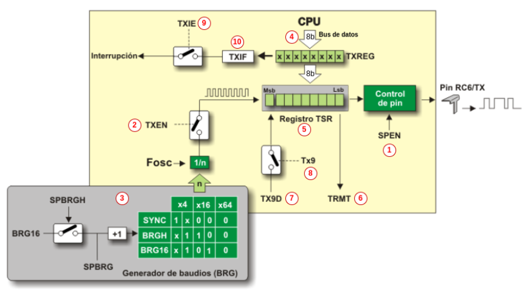

1.Activación del puerto serie (RCSTA_bit7_R/W): 1→Habilitado, 0→ Deshabilitado.

2.Habilitación de transmisión (TXTA_bit5_R/W): 
1→Habilitado, 0→ Deshabilitado.

3.Determinar el divisor del reloj para 
establecer la velocidad de baudios.

4.Dato a transmitir.

5.Registro de desplazamiento interno. Es el registro interno al que el hardware del UART transfiere los datos del buffer TXREG para luego enviarlos bit a bit por la línea TX.

6.Estado del registro TSR (TXSTA_bit1_R): 1→Vacío, 0→ Lleno.

7.Noveno bit a transmitir (TXSTA_bit0_W). Bit de paridad.

8.Habilitación del noveno bit (TXSTA_bit6_R/W): 1→Habilitado, 0→ Deshabilitado.

9.Habilitación de interrupción de transmisión (PIE1_bit4_R/W): 1→Habilitado, 0→ Deshabilitado.

10.Flag de interrupción de transmisión (PIR1_bit4_R/W): 1→Buffer de datos vacío, 0→ Deshabilitado.

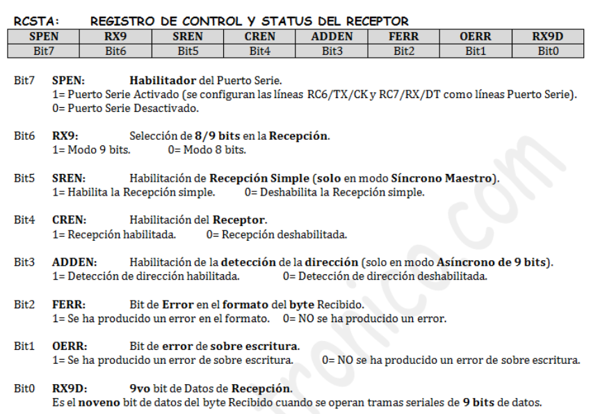

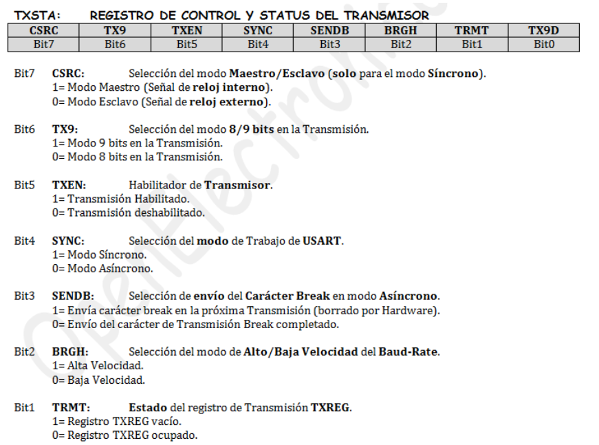

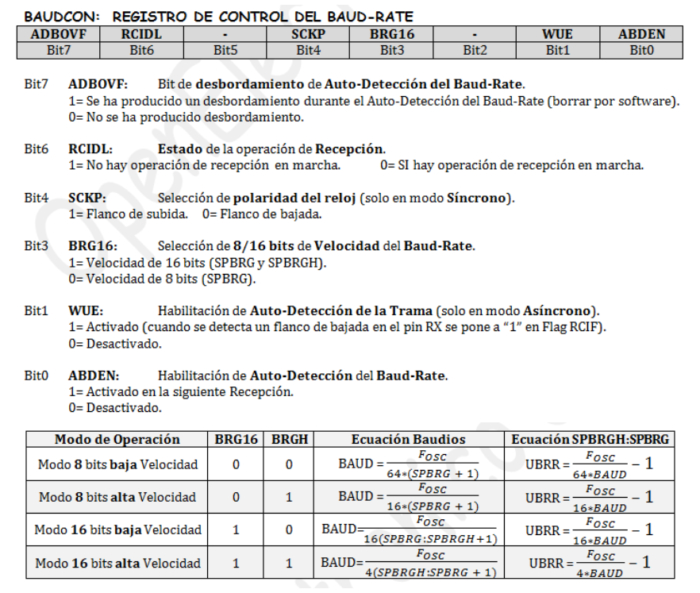

**Verficación con monitor serial**

**1.Parte 1**

Para observar los datos enviados por el PIC a través de UART, se debe usar un monitor serial. 

PuTTY (Windows/Linux)

Se descargo PuTTY desde https://www.putty.org.

Conectamos el PIC al PC a través del conversor serial

Abrimos PuTTY y seleccionamos:

Connection type: Serial

Serial line: (ej. COM3 en Windows, /dev/ttyUSB0 en Linux)

Speed (baud): 9600

Al hacer clic en Open. Se ven los mensajes enviados por el PIC.

**2.Parte 2**

Otra forma de visualizar la comunicación serial es haciendo uso de un script de Python, que recibe los datos enviados por el PIC18 a través del puerto UART y los representa en tiempo real mediante la librería matplotlib. Este script se abordara en clase.

Antes de ejecutar el script, debe verificarse el nombre del puerto serial al que está conectado el conversor USB a serial UART.

En Windows, el puerto tiene formato COMx, por ejemplo:

 SERIAL_PORT = 'COM3'
Pueden identificar el número desde el Administrador de dispositivos → Puertos (COM y LPT).

En Linux, el nombre del puerto suele ser:

SERIAL_PORT = '/dev/ttyUSB0'
o bien /dev/ttyACM0, dependiendo del adaptador utilizado.

Pueden verificarlo ejecutando en la terminal:

ls /dev/tty*

## EXPLICACIONES DE LOS CODIGOS

    #pragma config FOSC  = INTIO67
    #pragma config WDTEN = OFF
    #pragma config LVP   = OFF
    OSCCON = 0b01110000;
Usa el oscilador interno a 16 MHz, watchdog apagado, y low voltage programming desactivado.

    static int contador = 0;
Lleva la cuenta del valor actual que se convierte a voltaje. Empieza en 0 y sube de 5 en 5.
   
    UART_Init();
Configura la comunicación serial para poder enviar datos por UART.

    float voltaje = (contador / 255.0f) * 5.0f;
    sprintf(buffer, "Voltaje: %.2f\r\n", voltaje);
    UART_WriteString(buffer);
Convierte el contador (rango 0–255) a un voltaje equivalente en escala de 0 a 5V, lo formatea como texto y lo manda por UART.

    contador += 5;
    if (contador > 255) contador = 0;
    __delay_ms(100);
Incrementa el contador cada 100 ms y lo reinicia cuando supera 255, simulando un ciclo continuo tipo rampa de voltaje.

    TRISC6 = 0;
    TRISC7 = 1;
RC6 como salida (TX) y RC7 como entrada (RX).

    SPBRG1 = 25;
    TXSTA1bits.BRGH  = 0;
    BAUDCON1bits.BRG16 = 0;
Con FOSC = 16 MHz, baja velocidad y generador de 8 bits, el valor 25 en SPBRG1 da exactamente 9600 bps.

    RCSTA1bits.SPEN = 1;
    TXSTA1bits.SYNC = 0;
    TXSTA1bits.TXEN = 1;
    RCSTA1bits.CREN = 1;
Enciende el serial, modo asíncrono, habilita transmisión y recepción continua.

    while (!TXSTA1bits.TRMT);
    TXREG1 = data;
Espera a que el buffer de transmisión esté vacío antes de escribir el nuevo dato, evitando pérdida de datos.

    while (*str) {
        UART_WriteChar(*str++);
    }
Recorre el string carácter por carácter hasta encontrar el \0 final, enviando cada uno por UART.

    sprintf(buffer, "%d\r\n", value);
    UART_WriteString(buffer);
Convierte el entero a string con sprintf y lo manda por UART con salto de línea al final.
## Diagramas

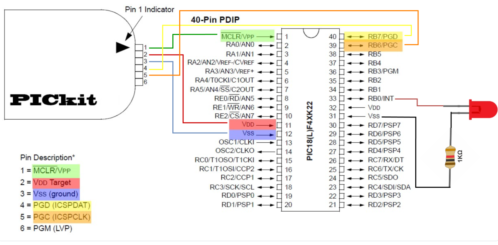

**Conexión PIC18F45K22 con PICkit 4**

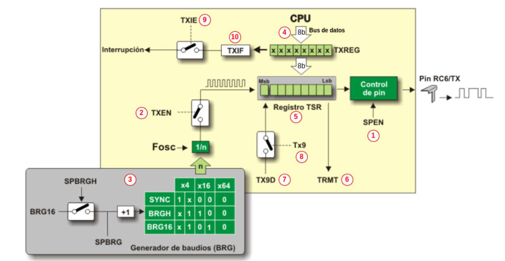

**Diagrama interno UART**

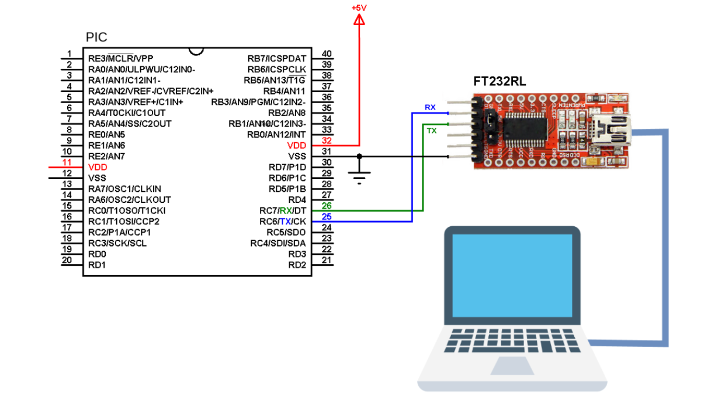

**Conexión PIC18F45K22 con UART**

## Evidencias de implementación

[video simulacion uart putty](https://youtu.be/b0C5SD2ICrg)

[video simulacion uart controlable con pot y script pyton](https://youtu.be/IB3nA1PuB9E)

